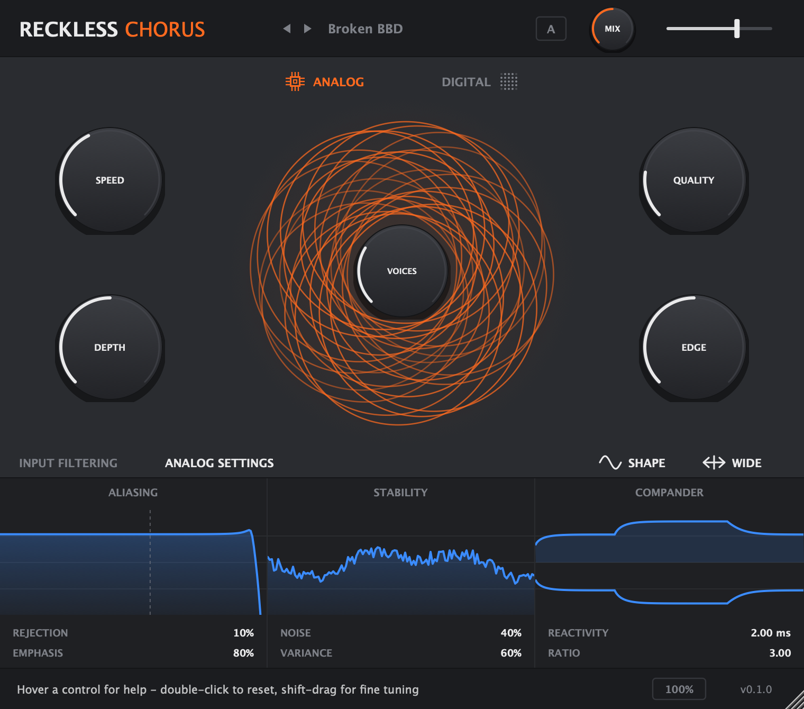

# RecklessChorus

Chorus VST3 / AU à deux moteurs — un modèle analogique de ligne à retard BBD et un moteur numérique propre — avec une architecture morphable de 1 à 8 voix et une interface entièrement redimensionnable.



> Projet indépendant, inspiré par le concept de *Thorus XT* d'UVI. Aucun code, nom, logo ni ressource graphique d'UVI n'est utilisé.

## Fonctionnalités

**Deux moteurs**
- **Analog** — émulation de bucket-brigade : filtres anti-repliement / reconstruction, horloge 1–48 kHz (échantillonnage-blocage), pré/dé-emphasis, compander (compression avant la ligne, expansion après, avec pompage naturel), saturation douce, souffle et dispersion par voix.
- **Digital** — une seule ligne à retard partagée lue par toutes les voix ; le contrôle *Quality* devient un réducteur de fréquence d'échantillonnage à bande limitée pour un grain lo-fi.

**Contrôles**

| Section | Contrôles |
|---|---|
| Principal | Speed, Depth, Voices (1→8, continu), Quality, Edge (brillance du signal traité) |
| En-tête | Presets d'usine, comparaison A/B, Mix, Output |
| Modulation | Shape (sinus / triangle), Wide (stéréo) |
| Input Filtering | Low Cut, High Cut (sur le signal entrant dans le chorus) |
| Analog Settings | Aliasing (Rejection, Emphasis), Stability (Noise, Variance), Compander (Reactivity, Ratio) |

**Interface**
- Redimensionnable de **50 % à 200 %** : poignée en bas à droite ou menu de taille dans la barre d'état. La taille est sauvegardée avec la session.
- Entièrement vectorielle (aucune image bitmap) : nette à toutes les tailles et sur écrans Retina.
- Barre d'aide : survolez un contrôle pour voir sa description. Double-clic = valeur par défaut, Maj + glisser = réglage fin.
- Couleur d'accent orange en mode Analog, bleue en mode Digital.

**Presets d'usine** : Default, Juno Mode I/II, Dimension Wash, Thick Ensemble, Vocal Shimmer, Lo-Fi Crunch, Vintage Pedal, Rotary-ish, Broken BBD, Slow Pad Drift.

## Téléchargement

Les binaires (macOS universel VST3 + AU, Windows VST3) sont publiés dans les [Releases](../../releases) à chaque tag `v*`.

Installation :
- macOS : copier `RecklessChorus.vst3` dans `~/Library/Audio/Plug-Ins/VST3/` (et `RecklessChorus.component` dans `~/Library/Audio/Plug-Ins/Components/`). Les binaires ne sont pas notarisés : au premier lancement, `xattr -dr com.apple.quarantine <chemin du plugin>` peut être nécessaire.
- Windows : copier `RecklessChorus.vst3` dans `C:\Program Files\Common Files\VST3\`.

## Compilation

Prérequis : CMake ≥ 3.22, un compilateur C++20 (Xcode / Command Line Tools sur macOS, Visual Studio 2022 sur Windows). JUCE 8 et Catch2 sont téléchargés automatiquement.

```bash
cmake -S . -B build -DCMAKE_BUILD_TYPE=Release
cmake --build build --config Release --parallel
ctest --test-dir build -C Release
```

Options CMake :

| Option | Défaut | Effet |
|---|---|---|
| `RECKLESS_BUILD_TESTS` | `ON` | Tests unitaires du moteur DSP (Catch2) |
| `RECKLESS_COPY_PLUGIN` | `OFF` | Copie les plugins dans les dossiers système après compilation |
| `RECKLESS_BUILD_SCREENSHOT` | `OFF` | Outil qui rend l'interface en PNG hors écran |

Les plugins sont produits dans `build/RecklessChorus_artefacts/Release/{VST3,AU,Standalone}`.

Pour réutiliser une copie locale de JUCE : `-DFETCHCONTENT_SOURCE_DIR_JUCE=/chemin/vers/JUCE`.

## Architecture

```
src/
  dsp/            Moteur audio en C++ pur (aucune dépendance JUCE, testable seul)
    DspPrimitives.h   biquad, ligne à retard Hermite, S&H, suiveur d'enveloppe, PRNG
    ChorusCore.*      chaîne complète des deux moteurs, 8 voix
  Parameters.*    Paramètres APVTS, textes d'aide, lecture temps réel sans verrou
  Presets.*       Presets d'usine
  PluginProcessor.*  Processeur JUCE : bus, état, A/B, presets
  PluginEditor.*  Éditeur : vue de taille fixe 760×670 mise à l'échelle par transformation affine
  ui/             LookAndFeel, potards, champs de valeur, visualiseur de voix, graphes
tests/            Tests Catch2 du moteur
tools/            Rendu PNG de l'interface
```

Chaîne du signal (côté traité) :

```
entrée → Low/High Cut → [Analog : pré-emphasis → compresseur → filtre AA → horloge BBD → saturation → souffle]
                         [Digital : S&H à bande limitée]
       → ligne à retard partagée → 1..8 voix modulées (L/R entrelacées en Wide)
       → [Analog : reconstruction → expandeur → dé-emphasis] → Edge → mix dry/wet → sortie
```

## Validation

- Tests unitaires : mix à 0 transparent au bit près, stabilité aux réglages extrêmes, silence sans souffle, décorrélation stéréo, mono, déterminisme.
- [pluginval](https://github.com/Tracktion/pluginval) en strictesse 10, en local et en CI.

## Licence

[AGPL-3.0](LICENSE), compatible avec la double licence de JUCE 8.
